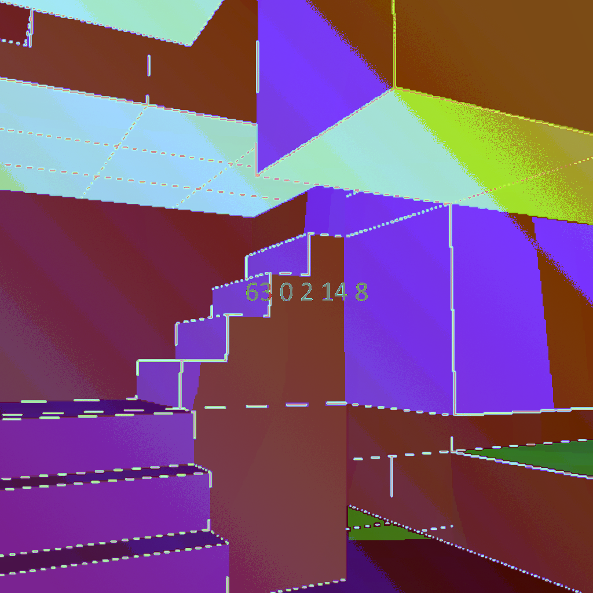
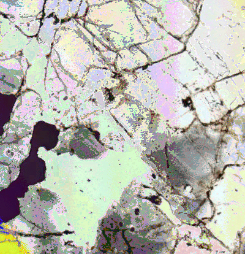
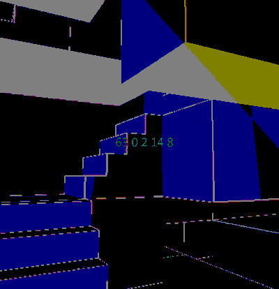
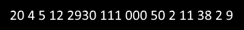
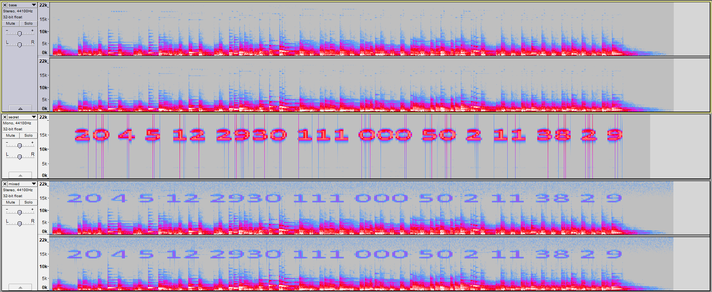

# Image-and-Sound-Steganography
A python script containing functions for embedding hidden data in images and sound.

Contains the following capabilities:

1. Secret Image within Another Image's Least Significant Bits (ImgImgE/ImgImgD):

Using the ImgImgE command, an image can be bitcrushed and stored within 1-8 of the least significant bits of another image.
As an example, say we want to hide this image (secret.png): 
 
within this one (base.png): 

Using the following command: "python stego.py ImgImgE base.png secret.png loaded.png 1 7" with stego.py in the same folder as base.png and secret.png, we can embed secret.png within the least significant bit of base.png:

It looks unchanged, but the data is there and retrievable via the command: "python stego.py ImgImgD loaded.png out.png 1 7"

Optionally, you can use more bits for a better output image (although the secret may become more visible), or even embed different images in each color channel.

2. Secret Image within an Audio File's spectrogram (ImgSnd):

Using the ImgSnd command, an image can be translated into an audio file whose spectrogram displays as the original image.
As an example, let's use this image:

Using a command like this: "python stego.py ImgSnd secret.png secret.wav 12000 20000 1 20 4000 0 16 41000", we can obtain a sound file with the appropriate spectrogram (see imgsnd example/secret.wav).
Then, we can mix it with some other audio or music (imgsnd example/base.wav), to create a sound file in which you cannot hear the secret audio, but if opened in a program like Audacity, the secret image can be made plainly visible (imgsnd example/mixed.wav):

